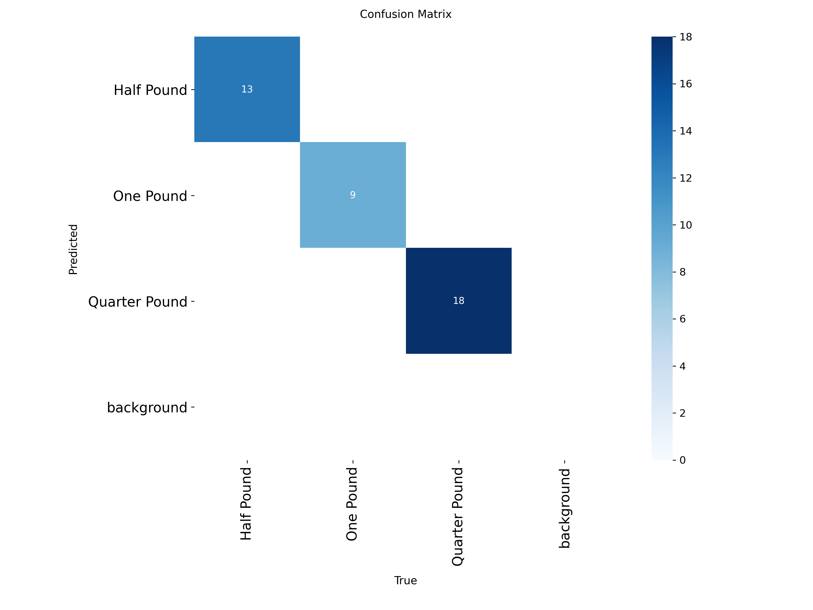

## Egyptian Coins Detection & Counter 🇪🇬💰
This project aims to detect and count Egyptian coins (One Pound, Half Pound, Quarter Pound) using the YOLOv8s framework. It not only identifies the classes but also calculates the total value in the image/video.
## Project Overview
**Framework:** Ultralytics YOLOv8
**Model:** YOLOv8s (Small)
**Classes:**
One Pound (1.0 EGP)
Half Pound (0.5 EGP)
Quarter Pound (0.25 EGP)
**Dataset:** Custom-made (Captured manually to ensure real-world accuracy).
##  Dataset
The dataset used for this project contains custom-captured images of Egyptian coins. Due to the large size of the image files, the dataset is hosted on Google Drive.

- **Total Images:** 122 (109 Train / 13 Val)
- **Annotations:** YOLOv8 format (Txt files)
- **Download Link:** [🔗 Download Egyptian Coins Dataset](https://drive.google.com/file/d/1u1CxIZGhXGLLWDD72868oueZREJxMMwP/view?usp=sharing)

> **Note:** If you want to retrain the model, download the folder and place it in the project root directory.
>
>##  Model Evaluation
The model achieved high accuracy during training:
**mAP50:** 0.995 (99.5%) 🚀
**mAP50-95:** 0.865
**Confusion Matrix**

Training Results

## Deployment & Logic
**The deployment script (main.py) includes a custom logic to:**
1.Detect each coin.
2.Assign a monetary value to each class.
3.Calculate the sum of all detected coins.
4.Display the total amount on the screen in real-time.
**Example of the result:**

